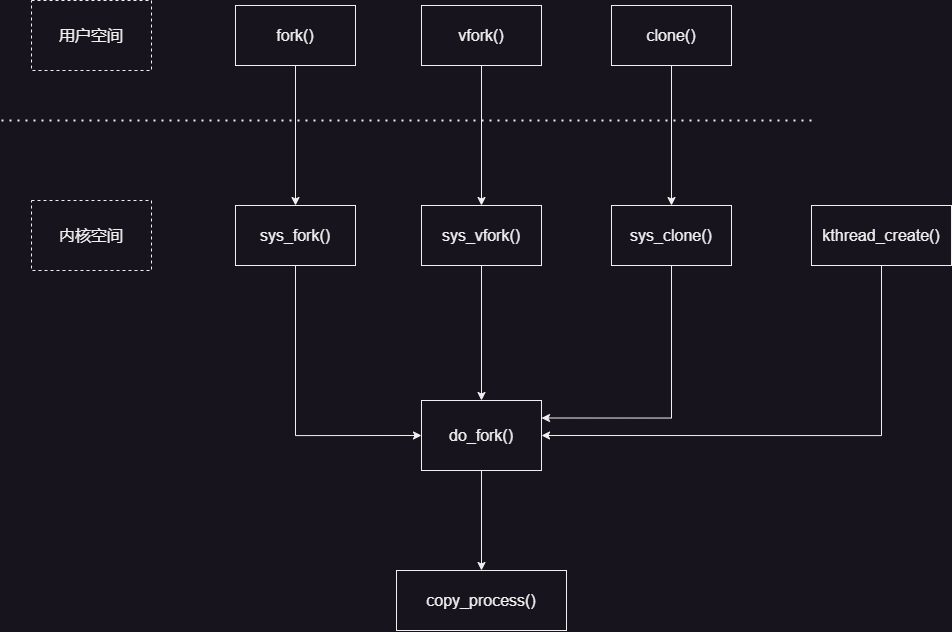
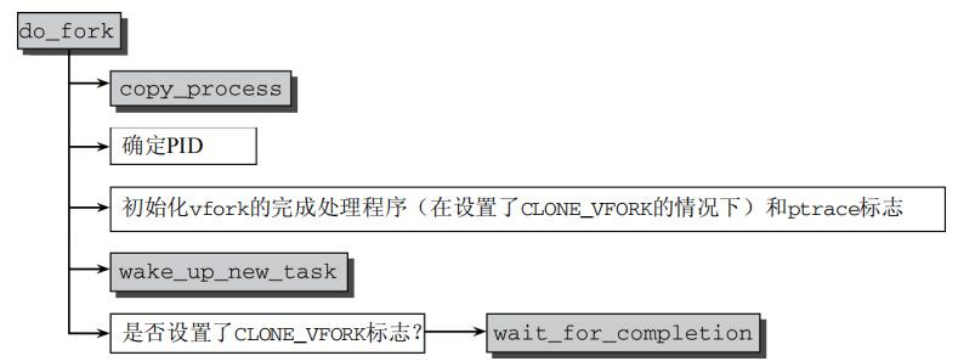

## 进程系统调用
系统调用是操作系统提供给用户态的接口，用户态进程通过系统调用请求操作系统提供的服务。系统调用的实现是操作系统内核的一部分，由内核态的进程执行，并通过系统调用陷入内核，由内核完成系统调用的功能。
### 1.进程复制-cpoy_process
传统的UNIX中用于复制进程的系统调用是fork。但它并不是Linux为此实现的唯一调用，实际上Linux实现了3个。
<br>
- (1)fork是重量级调用，因为它建立了父进程的一个完整副本，然后作为子进程执行。为减少与该调用相关的工作量，Linux使用了写时复制（copy-on-write）技术。<br>
- (2) vfork类似于fork，但并不创建父进程数据的副本。相反，父子进程之间共享数据。这节省了大量CPU时间（如果一个进程操纵共享数据，则另一个会自动注意到）。<br>
- (3) clone产生线程，可以对父子进程之间的共享、复制进行精确控制。<br>
**【写时复制】**
内核使用了写时复制（Copy-On-Write，COW）技术，以防止在fork执行时将父进程的所有数据复制到子进程。在调用fork时，内核通常对父进程的每个内存页，都为子进程创建一个相同的副本。<br>
**【执行系统调用】**
fork、vfork和clone系统调用的入口点分别是sys_fork、sys_vfork和sys_clone函数。其定义依赖于具体的体系结构，因为在用户空间和内核空间之间传递参数的方法因体系结构而异。<br>
**【do_fork实现】**
所有3个fork机制最终都调用kernel/fork.c中的do_fork（一个体系结构无关的函数），其代码流程如图所示。<br>
<br>
以下是fork、vfork、clone的源码：
```c
// kernel/fork.c
#ifdef __ARCH_WANT_SYS_FORK
SYSCALL_DEFINE0(fork)
{
#ifdef CONFIG_MMU
	struct kernel_clone_args args = {
		.exit_signal = SIGCHLD,
	};

	return _do_fork(&args);
#else
	/* can not support in nommu mode */
	return -EINVAL;
#endif
}
#endif

#ifdef __ARCH_WANT_SYS_VFORK
SYSCALL_DEFINE0(vfork)
{
	struct kernel_clone_args args = {
		.flags		= CLONE_VFORK | CLONE_VM,
		.exit_signal	= SIGCHLD,
	};

	return _do_fork(&args);
}
#endif

SYSCALL_DEFINE5(clone, unsigned long, clone_flags, unsigned long, newsp,
		 int __user *, parent_tidptr,
		 int __user *, child_tidptr,
		 unsigned long, tls)
#endif
{
	struct kernel_clone_args args = {
		.flags		= (lower_32_bits(clone_flags) & ~CSIGNAL),
		.pidfd		= parent_tidptr,
		.child_tid	= child_tidptr,
		.parent_tid	= parent_tidptr,
		.exit_signal	= (lower_32_bits(clone_flags) & CSIGNAL),
		.stack		= newsp,
		.tls		= tls,
	};

	if (!legacy_clone_args_valid(&args))
		return -EINVAL;

	return _do_fork(&args);
}
#endif

#ifndef CONFIG_HAVE_COPY_THREAD_TLS
/* For compatibility with architectures that call do_fork directly rather than
 * using the syscall entry points below. */
long do_fork(unsigned long clone_flags,//创建进程标志位集合
	      unsigned long stack_start,//用户栈的起始地址
	      unsigned long stack_size,//用户栈的大小，一般情况下为0
	      int __user *parent_tidptr,//指向用户空间中地址的指针，分别指向父子进程的PID
	      int __user *child_tidptr)
{
	struct kernel_clone_args args = {
		.flags		= (lower_32_bits(clone_flags) & ~CSIGNAL),
		.pidfd		= parent_tidptr,
		.child_tid	= child_tidptr,
		.parent_tid	= parent_tidptr,
		.exit_signal	= (lower_32_bits(clone_flags) & CSIGNAL),
		.stack		= stack_start,
		.stack_size	= stack_size,
	};

	if (!legacy_clone_args_valid(&args))
		return -EINVAL;

	return _do_fork(&args);
}
#endif
```
### 2.内核线程
内核线程是独立运行在内核空间的进程，与普通的用户进程区别在于内核线程没有独立的进程地址空间，task_struct数据结构里面有一个成员指针mm设置为NULL，它只能运行在内核空间。<br>
内核线程是直接由内核本身启动的进程。内核线程实际上是将内核函数委托给独立的进程，与系统中其他进程“并行”执行（实际上，也并行于内核自身的执行）。内核线程经常称之为（内核）守护进程。它们用于执行下列任务。<br>
- 周期性地将修改的内存页与页来源块设备同步（例如，使用mmap的文件映射）。
- 如果内存页很少使用，则写入交换区。
- 管理延时动作（deferred action）。• 实现文件系统的事务日志
内核线程源码如下:<br>
```c
pid_t kernel_thread(int (*fn)(void *), void *arg, unsigned long flags)
{
	struct kernel_clone_args args = {
		.flags		= ((lower_32_bits(flags) | CLONE_VM |
				    CLONE_UNTRACED) & ~CSIGNAL),
		.exit_signal	= (lower_32_bits(flags) & CSIGNAL),
		.stack		= (unsigned long)fn,
		.stack_size	= (unsigned long)arg,
	};

	return _do_fork(&args);
}
```
### 3.退出进程
进程必须用exit系统调用终止。这使得内核有机会将该进程使用的资源释放回系统。见kernel/exit.c------>do_exit。简而言之，该函数的实现就是将各个引用计数器减1，如果引用计数器归0而没有进程再使用对应的结构，那么将相应的内存区域返还给内存管理模块。<br>
- **进程主动终止**:从main()函数返回，链接程序会自动添加到exit()系统调用；主动调用exit()系统函数。<br>
- **进程被动终止**：进程收到一个自己不能处理的信号；进程收到SIGKILL等终止信息。<br>
源码如下：
```c
SYSCALL_DEFINE1(exit, int, error_code)
{
	do_exit((error_code&0xff)<<8);
}
```