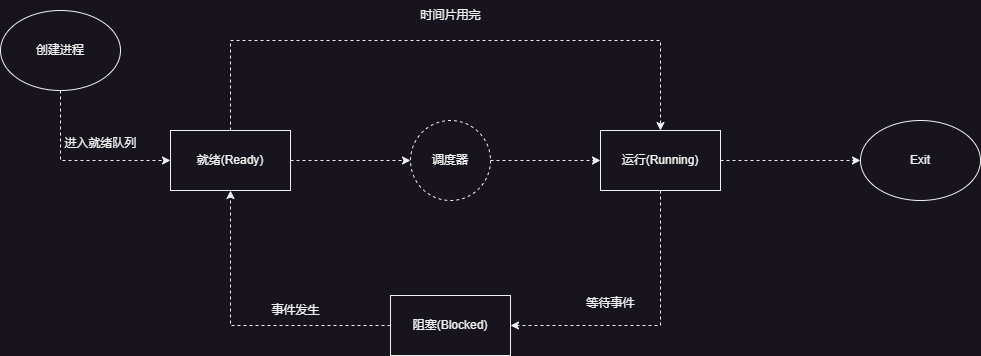
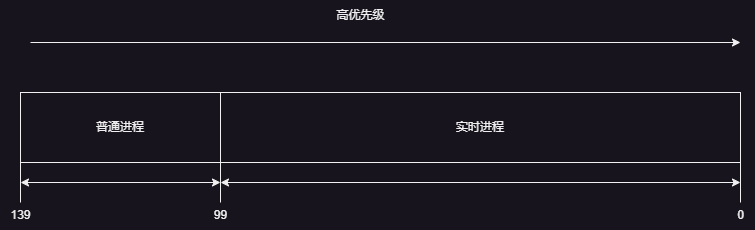
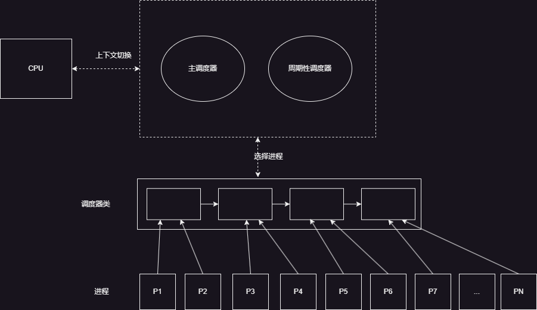

# 调度器及CFS调度器
## 1.调度器
内核中用来安排进程执行的模块称为调度器（scheduler），它可以切换进程状态（process state）。例如执行、可中断睡眠、不可中断睡眠、退出、暂停等。<br>
<br>
调度器相当于CPU中央处理器的管理员，主要负责两件事：<br>
1. 选择某些就绪进程来执行。<br>
2. 打断某些执行的进程，让它们变成就绪状态。<br>
- 调度器分配CPU时间的基本依据就是进程的优先级。<br>
- 上下文切换:将进程在CPU中切换执行的过程，内核担任此任务。负责重建和存储切换掉之前的CPU状态。<br><br>

- **1.调度**:就是按照某种调度的算法设计，从进程的就绪队列当中选取进程分配CPU，主要是协调对CPU等相关资源的使用。进程调度的目的：最大限度利用CPU时间。<br>
- **2.调度器**如果调度器支持就绪状态切换到执行状态，同时支持执行状态切换到就绪状态，那么就称为抢占式调度器。否则，就称为非抢占式调度器。<br>
- **3.调度类sched_class结构体的源码分析**:<br>
```c
// 调度类sched_class结构体如下:
struct sched_class {
	/*操作系统当中有多个调度类，按照调度优先级排成一个链表*/
	const struct sched_class *next;

#ifdef CONFIG_UCLAMP_TASK
	int uclamp_enabled;
#endif
	/*将进程加入到执行队列当中，即将调度实体(进程)存放到红黑树当中，并对nr_running变量自动加1*/
	void (*enqueue_task) (struct rq *rq, struct task_struct *p, int flags);
	/*将进程从执行队列当中移除，即将调度实体(进程)从红黑树当中移除，并对nr_running变量自动减1*/
	void (*dequeue_task) (struct rq *rq, struct task_struct *p, int flags);
	/*放弃CPU执行权限，实际上此函数执行先出队后入队，在这种它直接将调度实体存放在红黑树的最右端*/
	void (*yield_task)   (struct rq *rq);
	bool (*yield_to_task)(struct rq *rq, struct task_struct *p, bool preempt);
	/*专门用于检查当前进程是否可以被新进程抢占*/
	void (*check_preempt_curr)(struct rq *rq, struct task_struct *p, int flags);
	/*选择下一个要运行的进程*/
	struct task_struct *(*pick_next_task)(struct rq *rq);
	/*将进程施加到运行队列当中*/
	void (*put_prev_task)(struct rq *rq, struct task_struct *p);
	void (*set_next_task)(struct rq *rq, struct task_struct *p, bool first);

#ifdef CONFIG_SMP
	int (*balance)(struct rq *rq, struct task_struct *prev, struct rq_flags *rf);
	/*为进程选择一个合适的CPU*/
	int  (*select_task_rq)(struct task_struct *p, int task_cpu, int sd_flag, int flags);
	/*迁移任务到另一个CPU*/
	void (*migrate_task_rq)(struct task_struct *p, int new_cpu);
	/*专门用于唤醒进程*/
	void (*task_woken)(struct rq *this_rq, struct task_struct *task);
	/*设置进程的CPU亲和性*/
	void (*set_cpus_allowed)(struct task_struct *p,
				 const struct cpumask *newmask);
	/*启动或者禁止运行队列*/
	void (*rq_online)(struct rq *rq);
	void (*rq_offline)(struct rq *rq);
#endif

	void (*task_tick)(struct rq *rq, struct task_struct *p, int queued);
	void (*task_fork)(struct task_struct *p);
	void (*task_dead)(struct task_struct *p);

	/*
	 * The switched_from() call is allowed to drop rq->lock, therefore we
	 * cannot assume the switched_from/switched_to pair is serliazed by
	 * rq->lock. They are however serialized by p->pi_lock.
	 */
	
	void (*switched_from)(struct rq *this_rq, struct task_struct *task);
	void (*switched_to)  (struct rq *this_rq, struct task_struct *task);
	void (*prio_changed) (struct rq *this_rq, struct task_struct *task,
			      int oldprio);

	unsigned int (*get_rr_interval)(struct rq *rq,
					struct task_struct *task);

	void (*update_curr)(struct rq *rq);

#define TASK_SET_GROUP		0
#define TASK_MOVE_GROUP		1

#ifdef CONFIG_FAIR_GROUP_SCHED
	void (*task_change_group)(struct task_struct *p, int type);
#endif
};
```
- **4.调度器的分类**:调度器可分为:stop_sched_class,dl_sched_class,rt_sched_class,fair_sched_class以及idle_sched_class等。<br>
```c
extern const struct sched_class stop_sched_class;//停机调度类,优先级最高
extern const struct sched_class dl_sched_class;//限期调度类
extern const struct sched_class rt_sched_class;//实时调度类
extern const struct sched_class fair_sched_class;//公平调度类
extern const struct sched_class idle_sched_class;//空闲调度类
```
这五种调度类的优先级从高到低依次为:stop_sched_class//停机调度类,dl_sched_class//限期调度类,rt_sched_class//实时调度类,fair_sched_class//公平调度类,idle_sched_class//空闲调度类。<br>
**停机调度类**:优先级最高的调度类，停机进程是优先级最高的进程，可以抢占所有其他进程，其他进程不可能抢占停机进程。<br>
**限期调度类**:最早使用优先算法，使用红黑树把进程按照绝对截止期限从小到大排序，每次调度时选择截止期限最小的进程。<br>
**实时调度类**:为每一个调度优先级维护一个队列。<br>
**公平调度类**:使用完全公平调度算法。完全公平调度算法引入虚拟运行时间的相关概念:虚拟运行时间=实际运行时间*nice对应的权重/进程的权重。<br>
**空闲调度类**:每个CPU上有一个空闲线程，即0号进程，空闲调度类优先级别最低，仅当没有其他进程可以调度的时候，才会调度空闲的线程。<br>


## 2.进程优先级
Linux源码如下:<br>
```c
//Linux内核优先级如下
#define MAX_USER_RT_PRIO	100
#define MAX_RT_PRIO		MAX_USER_RT_PRIO

#define MAX_PRIO		(MAX_RT_PRIO + NICE_WIDTH)
#define DEFAULT_PRIO		(MAX_RT_PRIO + NICE_WIDTH / 2)
```
**进程分类**:
- 实时进程(Real-Time Process, RT Process):优先级高，需要立即执行的进程。<br>
- 普通进程(Normal Process, NP Process):优先级低，更长执行时间的进程。<br>
进程的优先级是一个0--139的整数直接表示。数字越小，优先级越高，其中优先级0-99为实时进程，100-139为普通进程。<br>
如下图所示:<br>
<br>

## 4.内核调度策略
源码如下:<br>
```c
#define SCHED_NORMAL		0
#define SCHED_FIFO		1
#define SCHED_RR		2
#define SCHED_BATCH		3
/* SCHED_ISO: reserved but not implemented yet */
#define SCHED_IDLE		5
#define SCHED_DEADLINE		6

/* Can be ORed in to make sure the process is reverted back to SCHED_NORMAL on fork */
#define SCHED_RESET_ON_FORK     0x40000000
```
**SCHED_NORMAL**:普通进程调度策略，使task选择CFS调度器运行。<br>
**SCHED_FIFO**:实时进程的调度策略，先进先出调度策略，没有时间片，没有更高优先级的状态下，只有等待主动让出CPU。<br>
**SCHED_RR**:实时进程的调度策略，时间片轮转调度策略，进程使用完时间片之后加入优先级对应运行队列当中的尾部，把CPU让给同等优先级的其他进程。<br>
**SCHED_BATCH**:普通进程调度策略，批量处理，使Task选择CFS调度器来调度运行。<br>
**SCHED_IDLE**:普通进程调度策略，使Task以最低的优先级选择CFS调度器来调度运行。<br>
**SCHED_DEADLINE**:限期进程调度策略，使task选择Deadline调度器来调度运行。<br>
**备注:其中stop调度器和DLE-task调度器，仅使用于内核，用户没有办法进行选择。**<br>

## 5.CFS调度器
**实际运行时间**:CFS是Completely Fair Scheduler的缩写，意思是完全公平调度器。在实际当中必须有进程优先级高或者进程优先级低，CFS调度器引入权重，使用权重代表进程优先级，各个进程按照权重比例分配CPU时间。<br>
假设有2个进程X和Y，X的权重为1024，Y的权重为2048。<br>
X获得CPU的时间比例为:1024/(1024+2048)=33.3%<br>
Y获得CPU的时间比例为:2048/(1024+2048)=66.6%<br>
在引入权重之后分配给进程的时间计算公式:实际运行时间=调度周期*进程权重/进程权重之和。<br>
**虚拟运行时间**：虚拟运行时间=实际运行时间*NICE_0_LOAD/进程权重=(调度周期*进程权重/所有进程权重之和)*NICE_0_LOA/进程权重=进程周期*1024/进程总权重<br>
在一个调度周期内，所有进程的虚拟运行时间是相同的，所以在进程调度时，只需要找到虚拟运行时间最小的进程调度运行即可。<br>
### 5.1调度子系统各个组件模块
调度器通过各个组件模块及一系列数据结构，来排序和管理系统中的进程。它们之间的关系如下图所示:<br>
<br>
**主调度器**:通过调用schedule()函数来完成进程的选择和切换。<br>
**周期性调度器**:根据频率自动调用scheduler_tick()函数，作用根据进程运行时间触发调度。<br>
**上下文切换**:主要做两个事情(切换地址空间，切换寄存器和栈空间)。<br>
### 5.2 CFS调度器类
CFS调度器类fair_sched_class的源码如下:<br>
```c
const struct sched_class fair_sched_class = {
	.next			= &idle_sched_class,//空闲调度类
	.enqueue_task		= enqueue_task_fair,//进程从睡眠状态变为可运行状态时调用
	.dequeue_task		= dequeue_task_fair,
    .yield_task		= yield_task_fair,//进程主动让出CPU时调用
    .yield_to_task		= yield_to_task_fair,
    .check_preempt_curr	= check_preempt_curr_fair,
    .pick_next_task		= pick_next_task_fair,//选择下一个要运行的进程
    .put_prev_task		= put_prev_task_fair,//进程主动放弃CPU时调用，用另一个进程替换自己
    .set_next_task		= set_next_task_fair,//设置下一个要运行的进程
```
**enqueue_task_fair**:当任务进入可运行状态时，将进程加入到执行队列当中，即将调度实体(进程)存放到红黑树当中，并对nr_running变量自动加1。<br>
**dequeue_task_fair**:当任务退出可运行状态时，将进程从执行队列当中移除，即将调度实体(进程)从红黑树当中移除，并对nr_running变量自动减1。<br>
### 5.3 CFS调度器就绪队列
**cfs_rq**:跟踪就绪队列信息以及管理就绪态调度实体，并维护一棵按照虚拟时间排序的红黑树。struct rb_root_cached	tasks_timeline->rb_root是红黑树的根节点，struct rb_root_cached	tasks_timeline->rb_leftmost指向红黑树最左边的调度实体，即虚拟时间最小的调度实体。<br>
源码如下:<br>
```c
struct cfs_rq {
	struct load_weight	load;
	unsigned long		runnable_weight;
	unsigned int		nr_running;
	unsigned int		h_nr_running;      /* SCHED_{NORMAL,BATCH,IDLE} */
	unsigned int		idle_h_nr_running; /* SCHED_IDLE */

	u64			exec_clock;
	u64			min_vruntime;
#ifndef CONFIG_64BIT
	u64			min_vruntime_copy;
#endif

	struct rb_root_cached	tasks_timeline;

	/*
	 * 'curr' points to currently running entity on this cfs_rq.
	 * It is set to NULL otherwise (i.e when none are currently running).
	 */
	//sched_entity可被内核调度的实体
	struct sched_entity	*curr;
	struct sched_entity	*next;
	struct sched_entity	*last;
	struct sched_entity	*skip;

#ifdef	CONFIG_SCHED_DEBUG
	unsigned int		nr_spread_over;
#endif

#ifdef CONFIG_SMP
	/*
	 * CFS load tracking
	 */
	struct sched_avg	avg;
#ifndef CONFIG_64BIT
	u64			load_last_update_time_copy;
#endif
	struct {
		raw_spinlock_t	lock ____cacheline_aligned;
		int		nr;
		unsigned long	load_avg;
		unsigned long	util_avg;
		unsigned long	runnable_sum;
	} removed;

#ifdef CONFIG_FAIR_GROUP_SCHED
	unsigned long		tg_load_avg_contrib;
	long			propagate;
	long			prop_runnable_sum;

	/*
	 *   h_load = weight * f(tg)
	 *
	 * Where f(tg) is the recursive weight fraction assigned to
	 * this group.
	 */
	unsigned long		h_load;
	u64			last_h_load_update;
	struct sched_entity	*h_load_next;
#endif /* CONFIG_FAIR_GROUP_SCHED */
#endif /* CONFIG_SMP */

#ifdef CONFIG_FAIR_GROUP_SCHED
	struct rq		*rq;	/* CPU runqueue to which this cfs_rq is attached */

	/*
	 * leaf cfs_rqs are those that hold tasks (lowest schedulable entity in
	 * a hierarchy). Non-leaf lrqs hold other higher schedulable entities
	 * (like users, containers etc.)
	 *
	 * leaf_cfs_rq_list ties together list of leaf cfs_rq's in a CPU.
	 * This list is used during load balance.
	 */
	int			on_list;
	struct list_head	leaf_cfs_rq_list;
	struct task_group	*tg;	/* group that "owns" this runqueue */

#ifdef CONFIG_CFS_BANDWIDTH
	int			runtime_enabled;
	s64			runtime_remaining;

	u64			throttled_clock;
	u64			throttled_clock_task;
	u64			throttled_clock_task_time;
	int			throttled;
	int			throttle_count;
	struct list_head	throttled_list;
#endif /* CONFIG_CFS_BANDWIDTH */
#endif /* CONFIG_FAIR_GROUP_SCHED */
};
```